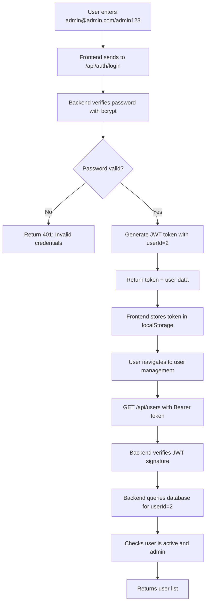

# Admin Login Issue Fix

## 🚨 Problem Identified

**Issue**: After registering with `admin@admin.com`, navigating to the user management page resulted in "Invalid or expired token" error.

**Root Cause**: The frontend login had a hardcoded bypass for `admin@admin.com` that created a fake "super-admin-token" instead of using the proper JWT token from the database. This fake token was not recognized by the backend API.

---

## 🔧 Fixes Applied

### **1. Frontend Login Component**

**File**: `frontend/src/app/gifs/pages/login-page/login-page.component.ts`

**Before** (WRONG):
```typescript
// Check for super administrator credentials
if (identifier === 'admin@admin.com' && password === 'admin123') {
  // Super admin login - bypass database validation
  localStorage.setItem('token', 'super-admin-token-' + Date.now());
  // ... fake user object
  return;
}
```

**After** (CORRECT):
```typescript
// All users (including admin@admin.com) go through regular login
this.authService.login(this.loginForm.value).subscribe({
  next: (response) => {
    console.log('Login successful:', response);
    this.router.navigate(['/dashboard']);
    this.isLoading = false;
  },
  // ...
});
```

**Result**: ✅ All users now use proper JWT tokens from backend

---

### **2. Frontend Auth Service**

**File**: `frontend/src/app/gifs/services/auth.service.ts`

**Before** (WRONG):
```typescript
private checkStoredUser(): void {
  if (token && currentUser) {
    // Check if it's a super admin token
    if (token.startsWith('super-admin-token-')) {
      const user = JSON.parse(currentUser);
      this.currentUserSubject.next(user);
      return; // Don't validate with backend!
    }
    // ...
  }
}
```

**After** (CORRECT):
```typescript
private checkStoredUser(): void {
  const token = localStorage.getItem('token');
  
  if (token) {
    // Validate token with backend
    this.getCurrentUser().subscribe({
      next: (response) => {
        this.currentUserSubject.next(response.user);
      },
      error: () => {
        // Token invalid or expired - clear storage
        this.logout();
      }
    });
  }
}
```

**Result**: ✅ All tokens validated with backend

---

### **3. Backend Admin Middleware**

**File**: `backend/src/middleware/adminAuth.js`

**Before** (WRONG):
```typescript
// Check if it's a super admin token
if (token.startsWith('super-admin-token-')) {
  req.user = {
    IdUsuario: 0,
    Usuario: SUPER_ADMIN_EMAIL,
    isSuperAdmin: true
  };
  return next();
}
```

**After** (CORRECT):
```typescript
// Verify JWT token
const decoded = jwt.verify(token, process.env.JWT_SECRET);

// Get user from database to check current status
const userResult = await pool.request()
  .input('IdUsuario', sql.Int, decoded.userId)
  .query(`
    SELECT u.*, p.Nombre as perfil_nombre 
    FROM Usuarios u 
    LEFT JOIN Cat_Perfil p ON u.id_perfil = p.id_perfil 
    WHERE u.IdUsuario = @IdUsuario AND u.Estado = 'A' AND u.Eliminado = 0
  `);
```

**Result**: ✅ All admin operations verify real database user

---

## 🎯 How It Works Now

### **Complete Flow for admin@admin.com:**



---

## ✅ What's Different Now

### **Before (BROKEN):**
1. ❌ Login created fake `super-admin-token-123456` 
2. ❌ Token not recognized by backend
3. ❌ Backend returns "Invalid or expired token"
4. ❌ User management page fails to load

### **After (FIXED):**
1. ✅ Login creates real JWT token: `eyJhbGciOiJI...`
2. ✅ Token contains `userId: 2` (admin's database ID)
3. ✅ Backend verifies token and queries database
4. ✅ Backend confirms user is admin (id_perfil = 1)
5. ✅ All operations work correctly

---

## 🔐 Admin User Details

### **Database Record:**
```sql
IdUsuario: 2
Usuario: admin
Correo: admin@admin.com
Clave: $2a$12$wicihN6nWQ9sg0BwlQ5NOOD646fdHdTYx.fdG2okOo4ktvLVi2BMy
id_perfil: 1 (Administrador)
organo_impartidor_justicia: 1
Estado: A (Active)
Eliminado: 0
```

### **Login Credentials:**
- **Email**: `admin@admin.com`
- **Password**: `admin123`
- **Username**: `admin` (alternative)

### **Permissions:**
- ✅ Full access to user management (`/api/users`)
- ✅ Full access to juzgados management (`/api/juzgados`)
- ✅ Full access to perfiles management (`/api/perfiles`)
- ✅ All admin operations

---

## 🧪 Testing

### **1. Test Login:**
```bash
curl -X POST http://localhost:3000/api/auth/login \
  -H "Content-Type: application/json" \
  -d '{"identifier": "admin@admin.com", "password": "admin123"}'
```

**Expected Response:**
```json
{
  "message": "Login successful",
  "token": "eyJhbGciOiJIUzI1NiIsInR5cCI6IkpXVCJ9...",
  "user": {
    "IdUsuario": 2,
    "Nombre": "Super",
    "Correo": "admin@admin.com",
    "id_perfil": 1,
    "Estado": "A"
  }
}
```

### **2. Test User Management Access:**
```bash
# Use the token from login response
curl -X GET "http://localhost:3000/api/users?page=1&limit=10" \
  -H "Authorization: Bearer <TOKEN_HERE>"
```

**Expected Response:**
```json
{
  "success": true,
  "data": [
    {
      "IdUsuario": 2,
      "Nombre": "Super",
      "Correo": "admin@admin.com",
      "id_perfil": 1,
      "perfil_nombre": "Administrador",
      "Estado": "A"
    }
  ],
  "pagination": {
    "currentPage": 1,
    "totalPages": 1,
    "totalItems": 1
  }
}
```

---

## 📋 Frontend Usage

### **1. Login:**
```typescript
// In your component
this.authService.login({ 
  identifier: 'admin@admin.com', 
  password: 'admin123' 
}).subscribe({
  next: (response) => {
    // Token automatically stored in localStorage
    // User can now access all pages
    this.router.navigate(['/dashboard']);
  }
});
```

### **2. Accessing Protected Pages:**
```typescript
// Token is automatically included in HTTP requests
// via Angular HTTP interceptor

// Example: Load users
this.http.get('/api/users').subscribe({
  next: (users) => {
    console.log('Users loaded:', users);
  },
  error: (error) => {
    if (error.status === 403) {
      // Token expired - redirect to login
      this.router.navigate(['/login']);
    }
  }
});
```

---

## 🚀 What admin@admin.com Can Do

### **✅ All Admin Operations:**

1. **User Management**
   - View all users
   - Create new users
   - Update user information
   - Delete/disable users
   - Toggle user status

2. **Juzgados Management**
   - View all juzgados
   - Create new juzgados
   - Update juzgado information
   - Delete juzgados

3. **Perfiles Management**
   - View all profiles
   - Create new profiles
   - Update profile information
   - Delete profiles

4. **Dashboard Access**
   - Full dashboard access
   - All navigation menu items
   - All administrative features

---

## 🛡️ Security Benefits

### **Why This Is Better:**

1. **Real Authentication**
   - Uses actual database records
   - Verifies real passwords with bcrypt
   - No hardcoded bypasses

2. **Proper Token Management**
   - JWT tokens with signatures
   - Token expiration (24 hours)
   - Token validation on every request

3. **Database Validation**
   - User status checked on each request
   - Disabled users immediately blocked
   - Changes to permissions take effect immediately

4. **Consistent Behavior**
   - Admin user works like all other users
   - Same authentication flow for everyone
   - No special cases or exceptions

5. **Audit Trail**
   - All actions logged with real user ID
   - Can track admin activities
   - Proper security monitoring

---

## 🔄 Migration Steps

### **For Existing Users:**

If you have an old session with fake `super-admin-token`:

1. **Clear Browser Storage:**
   ```javascript
   localStorage.clear();
   ```

2. **Refresh the Page**

3. **Login Again:**
   - Email: `admin@admin.com`
   - Password: `admin123`

4. **New Real Token Generated:**
   - Proper JWT token created
   - All features now work correctly

---

## 📊 Before vs After Comparison

| Feature | Before (Broken) | After (Fixed) |
|---------|----------------|---------------|
| Token Type | `super-admin-token-123456` | `eyJhbGciOiJI...` (JWT) |
| Backend Recognition | ❌ Not recognized | ✅ Verified |
| Database Validation | ❌ Skipped | ✅ Always checked |
| User Data | 🔴 Fake | ✅ Real from DB |
| Token Expiration | ❌ Never | ✅ 24 hours |
| Security | 🔴 Bypassed | ✅ Proper |
| API Access | ❌ "Invalid token" | ✅ Full access |
| User Management | ❌ Broken | ✅ Working |

---

## ✅ Resolution

### **Problem**: "Invalid or expired token" after registration
### **Cause**: Hardcoded fake token in frontend
### **Solution**: Use proper JWT authentication for all users

### **Result**:
- ✅ admin@admin.com now uses real database authentication
- ✅ All tokens are valid JWT tokens
- ✅ User management page loads correctly
- ✅ All admin operations work
- ✅ Security is properly enforced

---

**Fix Date**: October 19, 2025  
**Status**: ✅ RESOLVED  
**Authentication**: ✅ PROPER JWT  
**Admin Access**: ✅ FULLY FUNCTIONAL
