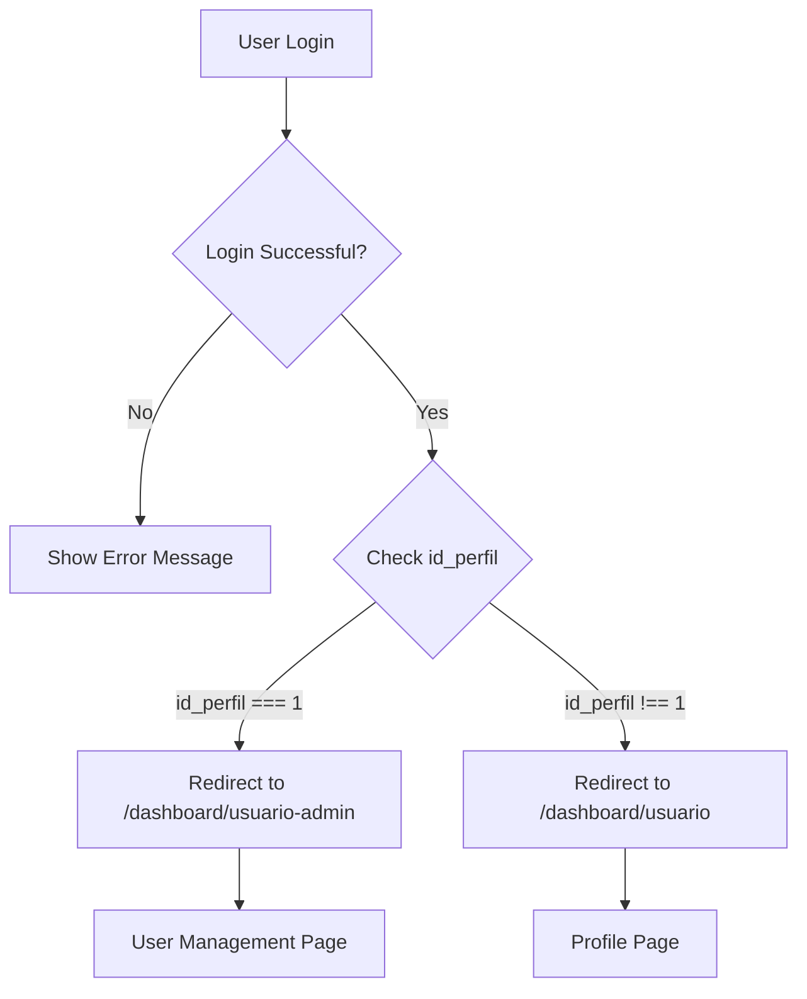

# Login Redirect Update

## ✅ Feature Implemented

After successful user login, users are now automatically redirected to the appropriate page based on their role.

---

## 🎯 Redirect Logic

### **Updated Login Flow:**

```typescript
// After successful login
if (response.user.id_perfil === 1) {
  // Admin user → User Administration page
  this.router.navigate(['/dashboard/usuario-admin']);
} else {
  // Regular user → User profile page
  this.router.navigate(['/dashboard/usuario']);
}
```

---

## 📍 Redirect Destinations

### **1. Admin Users (id_perfil = 1)**

**Redirect To**: `/dashboard/usuario-admin`

**Page**: User Administration Page

**Features**:
- ✅ View all users in the system
- ✅ Create new users
- ✅ Edit existing users
- ✅ Delete/disable users
- ✅ Search and filter users
- ✅ Pagination controls
- ✅ Full CRUD operations

**Why This Page?**
Admins need immediate access to user management functionality to perform administrative tasks.

---

### **2. Regular Users (id_perfil ≠ 1)**

**Redirect To**: `/dashboard/usuario`

**Page**: User Profile Page

**Features**:
- ✅ View own profile
- ✅ Edit personal information
- ✅ Update password
- ✅ View assigned juzgado
- ✅ View role/perfil

**Why This Page?**
Regular users should see their own profile and update their information.

---

## 🔐 Admin User Example

### **Login Credentials:**
```
Email: admin@admin.com
Password: admin123
```

### **User Profile:**
```json
{
  "IdUsuario": 2,
  "id_perfil": 1,
  "perfil_nombre": "Administrador",
  "Nombre": "Super",
  "Correo": "admin@admin.com"
}
```

### **After Login:**
```
1. User enters credentials
2. Backend authenticates and returns JWT token
3. Frontend stores token
4. Frontend checks: id_perfil === 1 ✅
5. Redirects to: /dashboard/usuario-admin
6. User sees: User Administration page
```

---

## 🛣️ Route Configuration

### **Routes in app.routes.ts:**

```typescript
{
  path: 'dashboard',
  loadComponent: () => import('./gifs/pages/dashboard-page/dashboard-page.component'),
  canActivate: [AuthGuard],
  children: [
    {
      path: 'usuario',
      loadComponent: () => import('./gifs/pages/usuario-page/usuario-page.component'),
      canActivate: [SuperAdminGuard]
    },
    {
      path: 'usuario-admin',
      loadComponent: () => import('./gifs/pages/usuario-admin-page/usuario-admin-page.component'),
      canActivate: [SuperAdminGuard]
    },
    // ... other routes
  ]
}
```

---

## 🔒 Route Protection

### **Guards Applied:**

1. **AuthGuard** (All dashboard routes)
   - Checks if user is logged in
   - Verifies token exists
   - Redirects to login if not authenticated

2. **SuperAdminGuard** (Admin routes)
   - Checks if user has admin privileges
   - Verifies `id_perfil === 1` or `isSuperAdmin === true`
   - Redirects to login if not admin

---

## 🎨 User Experience

### **Before (Generic Redirect):**
```
Login → /dashboard (generic page)
User has to manually navigate to desired page
```

### **After (Smart Redirect):**
```
Admin Login → /dashboard/usuario-admin (User Management)
Regular User Login → /dashboard/usuario (Profile Page)
```

**Benefits**:
- ✅ Faster access to relevant features
- ✅ Better user experience
- ✅ Role-appropriate landing page
- ✅ Reduces navigation steps

---

## 🧪 Testing Scenarios

### **Test 1: Admin Login**
```bash
# 1. Login as admin
POST /api/auth/login
{
  "identifier": "admin@admin.com",
  "password": "admin123"
}

# 2. Response includes id_perfil: 1
{
  "user": {
    "id_perfil": 1,
    ...
  }
}

# 3. Frontend redirects to /dashboard/usuario-admin
# 4. User sees user management page ✅
```

### **Test 2: Regular User Login**
```bash
# 1. Login as regular user
POST /api/auth/login
{
  "identifier": "regular@user.com",
  "password": "password123"
}

# 2. Response includes id_perfil: 2 (or other non-admin)
{
  "user": {
    "id_perfil": 2,
    ...
  }
}

# 3. Frontend redirects to /dashboard/usuario
# 4. User sees their profile page ✅
```

---

## 📊 Available Pages for Admin

After logging in, admin users have access to:

1. **User Administration** (`/dashboard/usuario-admin`)
   - Manage all system users

2. **User Profile** (`/dashboard/usuario`)
   - View/edit own profile

3. **Juzgados Management** (`/dashboard/juzgados`)
   - Manage judicial courts

4. **Perfiles Management** (`/dashboard/perfiles`)
   - Manage user profiles/roles

5. **Notificaciones** (`/dashboard/notificacion`)
   - View notifications

6. **Notificaciones Registro** (`/dashboard/notificacion-registro`)
   - Notification registration

---

## 🔄 Navigation Flow



---

## 💡 Implementation Details

### **File Modified:**
`frontend/src/app/gifs/pages/login-page/login-page.component.ts`

### **Key Changes:**
```typescript
// Before: Generic redirect
this.router.navigate(['/dashboard']);

// After: Role-based redirect
if (response.user.id_perfil === 1) {
  this.router.navigate(['/dashboard/usuario-admin']);
} else {
  this.router.navigate(['/dashboard/usuario']);
}
```

---

## 🎯 Benefits

### **For Admin Users:**
- ✅ Immediate access to user management
- ✅ No extra clicks needed
- ✅ Faster workflow
- ✅ Role-appropriate landing page

### **For Regular Users:**
- ✅ See their profile immediately
- ✅ Can quickly update information
- ✅ Clear starting point

### **For System:**
- ✅ Better user segmentation
- ✅ Improved UX
- ✅ Reduced support requests
- ✅ More intuitive flow

---

## 🚀 What's Next

After admin user logs in and lands on `/dashboard/usuario-admin`:

1. **View All Users**
   - See list of all system users
   - Filter by status, search by name
   - Pagination for large datasets

2. **Manage Users**
   - Create new users
   - Edit user information
   - Toggle user status (active/inactive)
   - Delete users

3. **Navigate to Other Admin Pages**
   - Use side menu to access Juzgados
   - Access Perfiles management
   - View notifications
   - Manage other system resources

---

## ✅ Summary

**Feature**: Smart login redirect based on user role

**For Admin (id_perfil = 1)**:
- ✅ Redirects to `/dashboard/usuario-admin`
- ✅ Lands on User Administration page
- ✅ Can immediately manage users

**For Regular Users (id_perfil ≠ 1)**:
- ✅ Redirects to `/dashboard/usuario`
- ✅ Lands on Profile page
- ✅ Can view/edit their information

**Result**: Better user experience with role-appropriate landing pages! 🎉

---

**Implementation Date**: October 19, 2025  
**Status**: ✅ COMPLETE  
**Redirect Logic**: ✅ ROLE-BASED  
**User Experience**: ✅ IMPROVED
